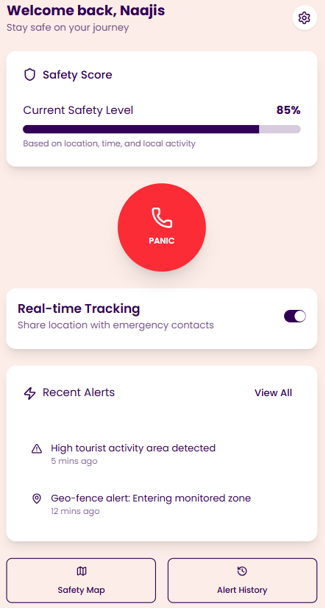
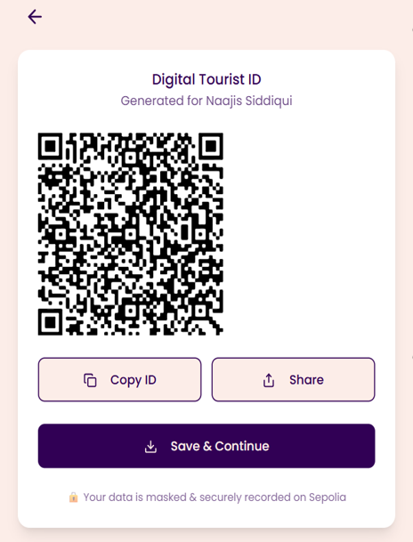
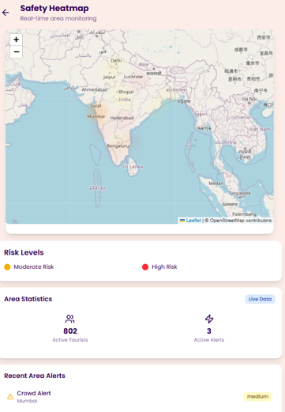

# 🚨 Smart Tourist Safety System

A blockchain-powered safety platform designed to enhance tourist security through digital identity, real-time monitoring, and emergency response systems.

## 🌍 Overview

This project integrates Web3 identity + real-time SOS alerts + geospatial risk analysis to provide a comprehensive safety ecosystem for travelers.

Users can:

- Generate a blockchain-backed digital ID
- Share identity securely via QR code
- Trigger SOS alerts with live location
- View risk-prone areas on an interactive map
- Enable real-time safety tracking

## 🔥 Key Features

### 🆔 Blockchain Digital Identity

- Tourist data securely stored on Ethereum Sepolia
- Masked sensitive details for privacy
- Tamper-proof identity system

### 📱 QR-Based Verification

- Generates unique QR containing masked identity + transaction hash
- Easily shareable and verifiable

### 🚨 SOS Emergency System

- One-tap panic button
- Sends live GPS coordinates to backend
- Alerts visible on police dashboard

### 🗺️ Safety Heatmap

- Interactive map using Leaflet
- Displays high-risk & moderate-risk zones
- Real-time visual safety awareness

### 👮 Police Dashboard

- Live SOS tracking with map markers
- Alert status management (new / seen / responded)
- Location-based monitoring

## 🧱 Tech Stack

### Frontend

- React (Vite)
- TypeScript
- Tailwind CSS
- Framer Motion

### Backend

- Node.js
- Express.js
- REST APIs

### Blockchain

- Solidity Smart Contract
- Hardhat
- ethers.js
- MetaMask integration

### Maps & Tracking

- Leaflet.js
- Heatmap visualization

## ⚙️ Project Structure

```
smart-tourist-safety/
├── backend/              # Main backend (blockchain interaction)
├── blockchain/           # Smart contract & deployment scripts
├── smart-tourist-web/    # Main frontend app
├── sos-demo/
│   ├── backend/          # SOS alert server
│   └── frontend/         # Police dashboard
```

## 🚀 Getting Started

### 1️⃣ Clone Repository

```
git clone https://github.com/naajissiddiqui/SafeSync.git
cd sSafeSync
```

### 2️⃣ Setup Environment Variables

Create `.env` files using `.env.example`

#### Backend

```
RPC_URL=your_sepolia_rpc_url
PRIVATE_KEY=your_wallet_private_key
CONTRACT_ADDRESS=your_contract_address
```

### 3️⃣ Run Blockchain

```
cd blockchain
npm install
npx hardhat run deploy.cjs --network sepolia
```

### 4️⃣ Run Main Backend

```
cd backend
npm install
node server.js
```

### 5️⃣ Run Frontend

```
cd smart-tourist-web
npm install
npm run dev
```

### 6️⃣ Run SOS System

```
cd sos-demo/backend
npm install
node server.js
```

Open:

- sos-demo/frontend/dashboard.html → Police dashboard
- sos-demo/frontend/index.html → SOS trigger demo

## 🧠 How It Works

1. User registers → data sent via MetaMask → stored on blockchain
2. Transaction hash generated → QR code created
3. Dashboard enables tracking + safety monitoring
4. SOS button sends live location to backend
5. Police dashboard visualizes alerts on map

## 📸 Screenshots

### 🏠 Dashboard



### 🆔 QR Code



### 🗺️ Safety Map



(Add screenshots of your app here — dashboard, QR, map, SOS panel)

## 🚀 Future Improvements

- Real-time WebSocket-based SOS updates
- AI-based risk prediction
- Multi-language support
- Mobile app version
- Integration with government systems

## 👨‍💻 Author

Naajis Siddiqui - Built as part of Smart India Hackathon (SIH) initiative.

## ⭐ If you like this project

Give it a star, it helps!
